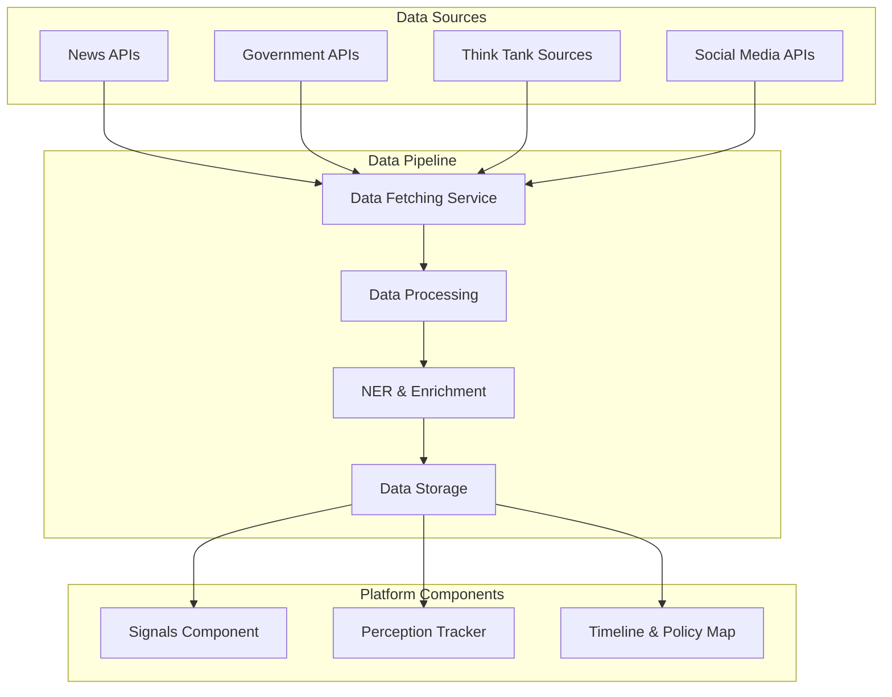

# Public Observatory of AI Geopolitics: API Integration Plan

This document outlines the API integration strategy for the Public Observatory of AI Geopolitics platform, focusing on enhancing the Signals component with external data sources.

## 1. API Categories and Sources

### I. News and Media APIs
These offer real-time or near real-time access to headlines, full articles, and metadata from global news sources:

1. **New York Times Developer API**
   - Focus: U.S.-centric but high-quality policy and tech coverage
   - Features: Tag-based searches (e.g., "semiconductors", "BIS", "AI regulation")
   - Link: https://developer.nytimes.com/
   - Integration Priority: High

2. **NewsAPI.org**
   - Focus: General headlines from major global outlets
   - Features: Simple to use for basic media tracking
   - Limitations: Not all full articles are included; best for titles/summaries
   - Link: https://newsapi.org/
   - Integration Priority: High

### II. Government and Regulatory Data APIs

3. **Regulations.gov API**
   - Focus: U.S. federal rulemaking, including BIS and Department of Commerce publications
   - Features: Tracking comments on rules like IFR 0694-AJ90
   - Link: https://open.gsa.gov/api/regulationsgov/
   - Integration Priority: Medium

4. **European Commission Open Data Portal**
   - Focus: EU policy announcements, Chips Act updates, public consultations
   - Link: https://data.europa.eu/en
   - Integration Priority: Medium

5. **Global Legal Monitor (Law Library of Congress)**
   - Features: Structured updates on national legal developments
   - Benefits: Good for tracking non-Western AI policy moves
   - Link: https://www.loc.gov/item/prn-16-146/
   - Integration Priority: Low (may require custom scraping)

### III. Think Tank and Research APIs

6. **CSET (Center for Security and Emerging Technology)**
   - Features: No public API, but valuable reports and datasets on AI policy and security
   - Method: Automated RSS parsing or scraping (if permitted)
   - Link: https://cset.georgetown.edu/publications/
   - Integration Priority: Medium

7. **OECD iLibrary API / SPARQL endpoints**
   - Focus: AI principles, international cooperation indicators
   - Features: SPARQL queries allow structured access to multilateral governance documents
   - Link: https://data.oecd.org/api/sdmx-json-documentation/
   - Integration Priority: Low (more complex integration)

### IV. Social Media and Perception APIs

8. **Pushshift.io (for Reddit)**
   - Benefits: Great for monitoring public discourse around AI geopolitics, memes, and OpenAI narratives
   - Use Case: Meme/perception tracker component
   - Link: https://pushshift.io/
   - Integration Priority: High (for Perception Tracker)

9. **Twitter/X API (via Academic Research or v2 API)**
   - Use Case: Track mentions of key actors (e.g., BIS, Nvidia, DeepSeek) and hashtags
   - Requirements: Approval for elevated access
   - Link: https://developer.twitter.com/en/docs/twitter-api
   - Integration Priority: Medium (dependent on access approval)

## 2. Integration Architecture



## 3. Data Pipeline Implementation

### 3.1 Data Fetching Service

The data fetching service will be responsible for retrieving data from the various APIs. It will:

- Run on a scheduled basis (e.g., hourly for news, daily for regulatory updates)
- Handle API authentication and rate limiting
- Normalize data from different sources into a common format
- Implement error handling and retry logic

```javascript
// Example data fetcher for NewsAPI
const fetchNewsData = async () => {
  try {
    const response = await axios.get('https://newsapi.org/v2/everything', {
      params: {
        q: 'AI regulation OR semiconductor export OR compute restriction',
        from: lastFetchDate,
        sortBy: 'publishedAt',
        apiKey: process.env.NEWS_API_KEY
      }
    });
    
    return normalizeNewsData(response.data.articles);
  } catch (error) {
    logError('NewsAPI fetch failed', error);
    return [];
  }
};
```

### 3.2 Data Processing

The data processing component will:

- Filter out irrelevant content
- Deduplicate articles and mentions
- Categorize content by topic, region, and actor
- Extract key entities and relationships

```javascript
// Example processing function
const processNewsData = (articles) => {
  return articles
    .filter(article => relevanceScore(article) > RELEVANCE_THRESHOLD)
    .map(article => ({
      ...article,
      categories: categorizeContent(article),
      entities: extractEntities(article)
    }));
};
```

### 3.3 Named Entity Recognition & Enrichment

This component will enhance the raw data with:

- Entity recognition (identifying companies, agencies, technologies)
- Sentiment analysis
- Topic modeling
- Relationship extraction
- Geolocation tagging

```javascript
// Example NER function using a hypothetical NLP service
const enrichWithNER = async (processedData) => {
  return Promise.all(processedData.map(async item => {
    const nerResult = await nlpService.analyze(item.content);
    
    return {
      ...item,
      entities: nerResult.entities,
      sentiment: nerResult.sentiment,
      topics: nerResult.topics,
      relationships: nerResult.relationships,
      geolocations: nerResult.locations
    };
  }));
};
```

### 3.4 Data Storage

The enriched data will be stored in the database with:

- Appropriate indexing for fast retrieval
- Relationships to other platform components
- Historical versioning for trend analysis
- Caching for frequently accessed data

## 4. Integration with Platform Components

### 4.1 Signals Component Integration

The Signals component will be enhanced to:

- Display relevant news and regulatory updates alongside user-submitted signals
- Suggest related external content when viewing a signal
- Allow users to reference external content in their signals
- Provide filtering options based on external data sources

### 4.2 Perception Tracker Integration

The Perception Tracker will leverage social media APIs to:

- Track narrative trends across platforms
- Identify emerging memes and discourse patterns
- Compare public perception with official narratives
- Visualize sentiment changes over time

### 4.3 Timeline & Policy Map Integration

The Timeline & Policy Map will incorporate regulatory and news data to:

- Automatically populate timeline events from regulatory announcements
- Link news coverage to timeline events
- Provide context for policy developments
- Show geographical distribution of AI policy developments

## 5. Implementation Roadmap

### Phase 1: Core News Integration (Weeks 1-2)
- Implement NewsAPI.org integration
- Develop basic data processing pipeline
- Create simple display of news items in Signals component

### Phase 2: Enhanced Processing (Weeks 3-4)
- Add Named Entity Recognition
- Implement sentiment analysis
- Develop categorization system

### Phase 3: Additional Sources (Weeks 5-6)
- Integrate New York Times API
- Add Regulations.gov API
- Implement Pushshift.io for Reddit data

### Phase 4: Advanced Features (Weeks 7-8)
- Develop relationship extraction
- Implement topic modeling
- Create visualization of narrative trends

### Phase 5: Remaining Sources (Post-MVP)
- Integrate remaining APIs based on priority
- Develop custom scrapers for sources without APIs
- Implement advanced analytics features

## 6. Technical Considerations

### 6.1 API Rate Limits and Quotas

Most APIs have rate limits and quotas that will need to be managed:

| API | Free Tier Limits | Paid Options |
|-----|------------------|--------------|
| NewsAPI | 100 requests/day | $449/month for 250K requests |
| NYT API | 4,000 requests/day | Custom pricing for higher volume |
| Twitter API | Limited access | Academic Research access available |
| Pushshift | Unlimited but rate-limited | N/A |

The system will need to implement:
- Rate limiting and request throttling
- Caching to reduce duplicate requests
- Batch processing where possible
- Fallback mechanisms when limits are reached

### 6.2 Authentication and Security

API keys and credentials will be:
- Stored securely in environment variables
- Never exposed to client-side code
- Rotated regularly
- Managed with appropriate access controls

### 6.3 Error Handling and Resilience

The integration will implement:
- Comprehensive error logging
- Automatic retries with exponential backoff
- Circuit breakers to prevent cascading failures
- Alerting for persistent issues
- Graceful degradation when services are unavailable

### 6.4 Data Privacy and Compliance

The system will:
- Respect terms of service for all APIs
- Implement appropriate data retention policies
- Anonymize personal data where required
- Provide attribution as required by API terms
- Comply with relevant regulations (GDPR, CCPA)

## 7. Future Expansion

### 7.1 Additional Data Sources

Future iterations could incorporate:
- Academic paper repositories (arXiv, SSRN)
- Patent databases
- Investment and funding databases
- Additional international regulatory sources
- Specialized AI research platforms

### 7.2 Advanced Analytics

Later phases could implement:
- Predictive analytics for policy trends
- Network analysis of actor relationships
- Automated narrative detection
- Cross-source correlation analysis
- Machine learning for content relevance scoring

### 7.3 User Contribution to Data Pipeline

Eventually, the platform could allow:
- User submission of new data sources
- Collaborative tagging and categorization
- Expert verification of automated classifications
- Community voting on relevance and importance
- Custom alert creation for specific topics or entities