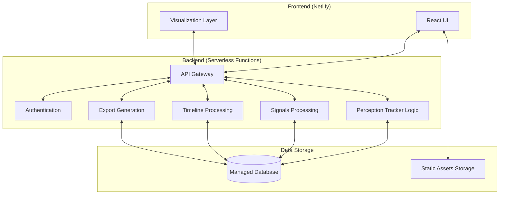
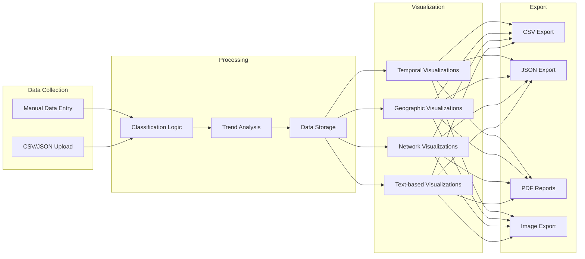
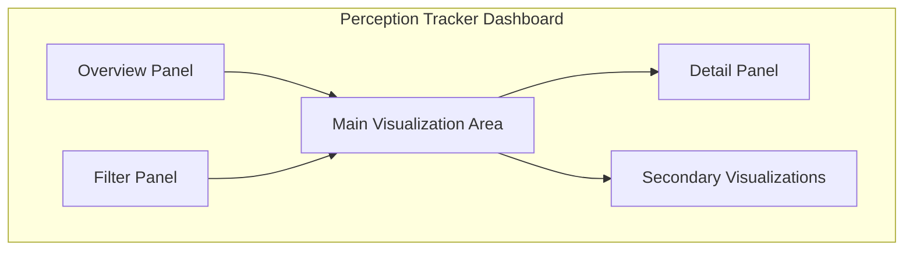
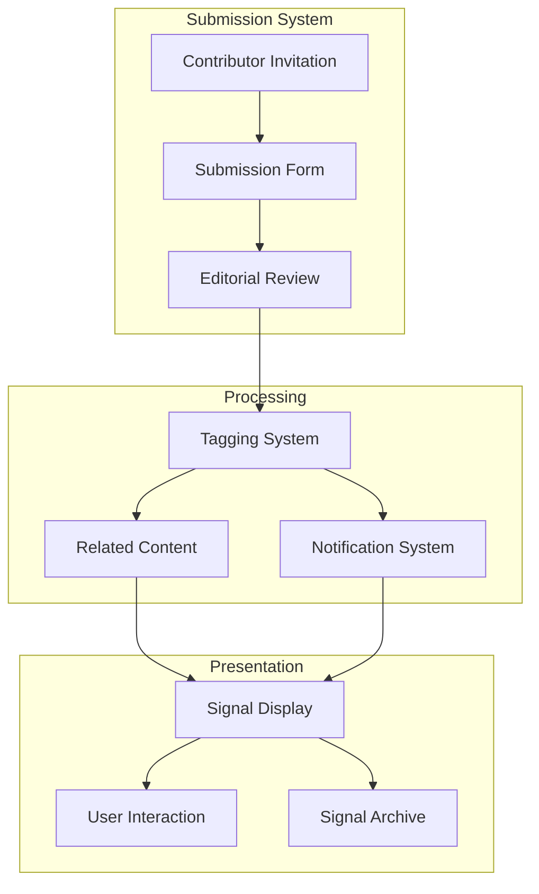
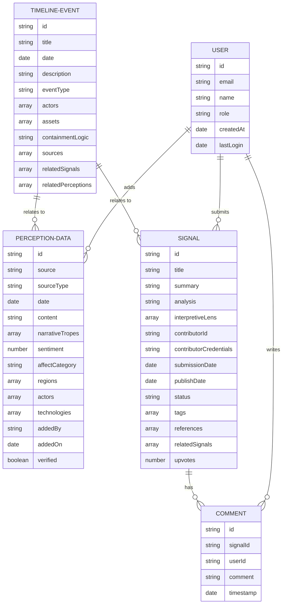

# Public Observatory of AI Geopolitics: Detailed Implementation Plan

## 1. Project Overview

### Goals
- Create an educational resource for researchers and students focused on AI geopolitics
- Provide unique insights through the Perception Tracker and Signals components
- Launch an MVP within 3 months with a small team of 3-5 contributors
- Keep infrastructure costs low and maintenance simple

### Key Components for MVP
1. **Perception Tracker**: Manual data collection initially, with visualization of media headlines, social media discourse, and narrative tropes
2. **Signals**: Basic submission system for contributors with insights and analysis
3. **Simplified Timeline & Policy Map**: Basic version to provide context for the other components
4. **User Authentication & Management**: For content contributors and signal submissions

## 2. System Architecture



### Technology Stack
- **Frontend**: React with TypeScript, visualization libraries (detailed below), hosted on Netlify
- **Backend**: Serverless functions (AWS Lambda or Netlify Functions) with Python/Node.js
- **Database**: MongoDB Atlas or Supabase (PostgreSQL)
- **Authentication**: Auth0 or Supabase Auth
- **Static Assets**: Netlify or AWS S3
- **CI/CD**: GitHub Actions for automated deployment

## 3. Component Design

### 3.1 Perception Tracker



#### Features
- Form-based interface for manual data entry by team members
- Bulk upload functionality for CSV/JSON data
- Classification system for categorizing content (headlines, social media posts, etc.)
- Comprehensive visualization dashboard (detailed in section 3.1.1)
- Search and filtering capabilities
- Export functionality for research use (detailed in section 3.1.2)

#### Data Structure
```json
{
  "perceptionData": {
    "source": "string",
    "sourceType": "media|social|academic|policy",
    "date": "timestamp",
    "content": "string",
    "narrativeTropes": ["string"],
    "sentiment": "number",
    "affectCategory": "string",
    "regions": ["string"],
    "actors": ["string"],
    "technologies": ["string"],
    "keywords": ["string"],
    "url": "string",
    "language": "string",
    "addedBy": "userId",
    "addedOn": "timestamp",
    "verified": "boolean"
  }
}
```

#### 3.1.1 Perception Tracker Visualization System

The Perception Tracker will feature a comprehensive visualization system that combines multiple visualization types to provide a holistic view of AI geopolitics narratives and perceptions.

##### Visualization Types and Libraries

**1. Temporal Visualizations**

*Purpose*: Track how narratives, sentiments, and tropes evolve over time

*Recommended Libraries*:
- **Recharts**: A composable charting library built on React components with a simple API
- **Apache ECharts**: A powerful charting library with rich interactive features
- **Visx**: A collection of reusable low-level visualization components from Airbnb

*Visualization Types*:
- Line charts for tracking narrative trends over time
- Heat maps showing intensity of coverage across time periods
- Stacked area charts for comparing multiple narratives simultaneously
- Timeline views with event markers for significant developments

*Implementation Example*:
```jsx
import { AreaChart, Area, XAxis, YAxis, CartesianGrid, Tooltip, ResponsiveContainer } from 'recharts';

const NarrativeTrendChart = ({ data }) => (
  <ResponsiveContainer width="100%" height={400}>
    <AreaChart data={data}>
      <CartesianGrid strokeDasharray="3 3" />
      <XAxis dataKey="date" />
      <YAxis />
      <Tooltip />
      <Area type="monotone" dataKey="safety" stackId="1" stroke="#8884d8" fill="#8884d8" />
      <Area type="monotone" dataKey="power" stackId="1" stroke="#82ca9d" fill="#82ca9d" />
      <Area type="monotone" dataKey="economic" stackId="1" stroke="#ffc658" fill="#ffc658" />
    </AreaChart>
  </ResponsiveContainer>
);
```

**2. Geographic Visualizations**

*Purpose*: Visualize regional differences in AI narratives and regulatory approaches

*Recommended Libraries*:
- **React Simple Maps**: Simplified SVG maps with React
- **Leaflet** (with react-leaflet): Interactive maps with extensive plugin ecosystem
- **Mapbox GL JS**: High-performance vector maps (requires API key but has free tier)

*Visualization Types*:
- Choropleth maps showing narrative intensity by region
- Point maps highlighting key actors or events by location
- Comparative maps showing regulatory differences between regions
- Flow maps showing relationships and influences between regions

*Implementation Example*:
```jsx
import { ComposableMap, Geographies, Geography, Marker } from "react-simple-maps";

const geoUrl = "https://raw.githubusercontent.com/deldersveld/topojson/master/world-countries.json";

const MapChart = ({ data }) => (
  <ComposableMap>
    <Geographies geography={geoUrl}>
      {({ geographies }) =>
        geographies.map(geo => (
          <Geography
            key={geo.rsmKey}
            geography={geo}
            fill={getColorByNarrativeIntensity(geo.properties.name, data)}
            stroke="#FFFFFF"
          />
        ))
      }
    </Geographies>
    {data.keyEvents.map(({ name, coordinates }) => (
      <Marker key={name} coordinates={coordinates}>
        <circle r={5} fill="#F00" />
        <text textAnchor="middle" y={-10}>
          {name}
        </text>
      </Marker>
    ))}
  </ComposableMap>
);
```

**3. Network Visualizations**

*Purpose*: Show relationships between actors, narratives, technologies, and regulatory frameworks

*Recommended Libraries*:
- **React Force Graph**: Force-directed graph layouts with React bindings
- **Sigma.js**: Specialized in graph drawing for network visualization
- **vis.js Network**: Flexible network visualization with many configuration options

*Visualization Types*:
- Force-directed graphs showing relationships between actors
- Sankey diagrams showing flows between narrative sources and themes
- Chord diagrams showing connections between technologies and regulatory frameworks
- Hierarchical edge bundling for showing complex relationships

*Implementation Example*:
```jsx
import ForceGraph2D from 'react-force-graph-2d';

const NetworkGraph = ({ data }) => (
  <ForceGraph2D
    graphData={data}
    nodeLabel="name"
    nodeColor={node => node.group === 'actor' ? '#ff0000' : 
               node.group === 'narrative' ? '#00ff00' : '#0000ff'}
    linkDirectionalArrowLength={3}
    linkDirectionalArrowRelPos={1}
    linkCurvature={0.25}
    onNodeClick={handleNodeClick}
  />
);
```

**4. Text-based Visualizations**

*Purpose*: Analyze and visualize textual content, sentiment, and linguistic patterns

*Recommended Libraries*:
- **react-wordcloud**: Simple word cloud component for React
- **d3-cloud**: More customizable word cloud layouts
- **vega-lite** (with react-vega): Declarative visualizations including text-based ones

*Visualization Types*:
- Word clouds showing key terms and their frequency
- Sentiment analysis visualizations showing emotional tone
- Comparative text analysis showing differences in framing
- Topic modeling visualizations showing thematic clusters

*Implementation Example*:
```jsx
import ReactWordcloud from 'react-wordcloud';

const options = {
  rotations: 2,
  rotationAngles: [0, 90],
  fontSizes: [10, 60],
};

const WordCloudChart = ({ words }) => (
  <div style={{ height: 400, width: '100%' }}>
    <ReactWordcloud words={words} options={options} />
  </div>
);
```

##### Interactive Features

All visualizations will include the following interactive features:

- **Filtering**: By date range, region, actor, technology, narrative type
- **Zooming and Panning**: For maps and network visualizations
- **Tooltips and Hover Effects**: For detailed information on demand
- **Linked Views**: Selections in one visualization affect others
- **Animation**: For showing changes over time or transitions between states
- **Responsive Design**: Adapting to different screen sizes and devices

##### Visualization Dashboard Layout

The visualization dashboard will be organized into:

1. **Overview Panel**: Summary metrics and key indicators
2. **Main Visualization Area**: Primary visualization with controls
3. **Secondary Visualizations**: Smaller, related visualizations
4. **Filter Panel**: Controls for filtering and customizing visualizations
5. **Detail Panel**: Shows detailed information for selected elements



#### 3.1.2 Export System

The export system will provide comprehensive options for researchers to use the data in their work:

**Data Export Formats**:
- **CSV**: For spreadsheet analysis and statistical software
- **JSON**: For programmatic use and custom analysis
- **Excel**: For more complex spreadsheet analysis

**Visualization Export Formats**:
- **PNG/JPEG**: Static images for publications
- **SVG**: Vector graphics for high-quality publication
- **PDF**: Complete reports with visualizations and analysis

**PDF Report Generation**:
- Custom report templates for different research needs
- Inclusion of selected visualizations with annotations
- Metadata and citation information
- Executive summaries of key findings
- Methodology documentation

**Implementation Approach**:
- Client-side export for simple formats (PNG, SVG)
- Server-side generation for complex formats (PDF reports)
- Scheduled report generation for regular updates
- Custom report builder interface for researchers

```jsx
// Client-side image export example
const exportVisualization = (chartRef, filename) => {
  const svgElement = chartRef.current.container.firstChild;
  const svgData = new XMLSerializer().serializeToString(svgElement);
  const canvas = document.createElement('canvas');
  const ctx = canvas.getContext('2d');
  
  const img = new Image();
  img.onload = () => {
    canvas.width = img.width;
    canvas.height = img.height;
    ctx.drawImage(img, 0, 0);
    const pngFile = canvas.toDataURL('image/png');
    
    // Create download link
    const downloadLink = document.createElement('a');
    downloadLink.download = `${filename}.png`;
    downloadLink.href = pngFile;
    downloadLink.click();
  };
  
  img.src = 'data:image/svg+xml;base64,' + btoa(svgData);
};
```

### 3.2 Signals



#### Features
- Invitation system for contributors
- Structured submission form with:
  - Signal title and summary
  - Detailed analysis
  - Interpretive lens selection
  - Supporting references
  - Metadata tagging
- Editorial review workflow
- Tagging system for categorization
- User interaction (upvoting, commenting)
- Notification system for new signals
- Archiving and search functionality

#### Data Structure
```json
{
  "signal": {
    "title": "string",
    "summary": "string",
    "analysis": "string",
    "interpretiveLens": ["security|ethics|industrial|social|legal"],
    "contributorId": "userId",
    "contributorCredentials": "string",
    "submissionDate": "timestamp",
    "publishDate": "timestamp",
    "status": "draft|review|published|archived",
    "tags": ["string"],
    "references": ["string"],
    "relatedSignals": ["signalId"],
    "relatedPerceptionData": ["perceptionId"],
    "upvotes": "number",
    "comments": [{
      "userId": "string",
      "comment": "string",
      "timestamp": "timestamp"
    }]
  }
}
```

### 3.3 Simplified Timeline & Policy Map

For the MVP, this will be a streamlined version providing context for the other components:

- Basic chronological display of key regulatory developments
- Simple filtering by actor or asset type
- Integration with Signals (showing related signals for timeline events)
- Minimal interactivity for the MVP, with plans for enhancement in future iterations

#### Data Structure
```json
{
  "timelineEvent": {
    "title": "string",
    "date": "timestamp",
    "description": "string",
    "eventType": "regulation|corporate|bloc|other",
    "actors": ["string"],
    "assets": ["string"],
    "containmentLogic": "string",
    "sources": ["string"],
    "relatedSignals": ["signalId"],
    "relatedPerceptions": ["perceptionId"]
  }
}
```

## 4. Data Model



## 5. User Experience and Interface Design

### User Types
1. **Visitors**: Researchers, students, and general public accessing the platform
2. **Contributors**: Team members adding perception data and timeline events
3. **Contributors**: Users submitting signals and analysis
4. **Administrators**: Managing the platform, users, and content

### Key Interfaces

#### Visitor Experience
- Homepage with featured content and navigation
- Perception Tracker visualization dashboard
- Signals browsing and filtering interface
- Basic Timeline view
- Search functionality
- User registration/login

#### Contributor Dashboard
- Data entry forms for Perception Tracker
- Bulk upload interface
- Content management tools
- Analytics on user engagement

#### Contributor Interface
- Signal submission form
- Draft management
- Profile management
- Notification center

#### Admin Panel
- User management
- Content moderation
- System configuration
- Invitation management for contributors

### Design Principles
- Clean, academic aesthetic
- Mobile-responsive design
- Accessible interface (WCAG 2.1 AA compliance)
- Clear data visualization with consistent color coding
- Intuitive navigation between related components

## 6. Development Roadmap and Timeline

### Month 1: Foundation and Setup (Weeks 1-4)
- Week 1: Project setup, repository creation, CI/CD pipeline
- Week 2: Database schema implementation and API design
- Week 3: Authentication system and user management
- Week 4: Basic frontend structure and navigation

### Month 2: Core Components Development (Weeks 5-8)
- Week 5-6: Perception Tracker - data entry, storage, and basic visualization
- Week 7: Signals - submission system, review workflow, and display
- Week 8: Initial API integration - NewsAPI.org and basic data processing pipeline

### Month 3: Integration and Launch Preparation (Weeks 9-12)
- Week 9: Simplified Timeline implementation and enhanced API processing (NER, sentiment analysis)
- Week 10: Component integration, relationship mapping, and additional API sources
- Week 11: Testing, bug fixing, and performance optimization
- Week 12: Documentation, final polishing, and MVP launch

### Post-MVP Priorities
1. Expanded API integrations (additional news sources, social media, and regulatory APIs)
2. Enhanced visualization capabilities
3. Advanced Timeline & Policy Map features
4. Agent-Based Scenarios & Simulations
5. Mobile application

## 7. Technical Implementation Plan

### Frontend Implementation

#### React Component Structure
```
src/
├── components/
│   ├── common/
│   │   ├── Header.tsx
│   │   ├── Footer.tsx
│   │   ├── Navigation.tsx
│   │   └── ...
│   ├── perception/
│   │   ├── PerceptionDashboard.tsx
│   │   ├── DataEntryForm.tsx
│   │   ├── visualizations/
│   │   │   ├── TemporalVisualizations.tsx
│   │   │   ├── GeographicVisualizations.tsx
│   │   │   ├── NetworkVisualizations.tsx
│   │   │   ├── TextVisualizations.tsx
│   │   │   └── ...
│   │   ├── export/
│   │   │   ├── DataExport.tsx
│   │   │   ├── ReportGenerator.tsx
│   │   │   └── ...
│   │   └── ...
│   ├── signals/
│   │   ├── SignalsList.tsx
│   │   ├── SignalDetail.tsx
│   │   ├── SubmissionForm.tsx
│   │   └── ...
│   └── timeline/
│       ├── TimelineView.tsx
│       └── ...
├── hooks/
│   ├── useAuth.ts
│   ├── usePerceptionData.ts
│   ├── useVisualization.ts
│   └── ...
├── services/
│   ├── api.ts
│   ├── auth.ts
│   ├── export.ts
│   └── ...
├── utils/
│   ├── formatting.ts
│   ├── visualization.ts
│   ├── dataProcessing.ts
│   └── ...
└── pages/
    ├── Home.tsx
    ├── PerceptionTracker.tsx
    ├── ExpertSignals.tsx
    ├── Timeline.tsx
    ├── Admin.tsx
    └── ...
```

#### State Management
- React Context API for global state
- React Query for API data fetching and caching
- Local component state for UI-specific state

### Backend Implementation

#### Serverless Functions Structure
```
functions/
├── auth/
│   ├── login.js
│   ├── register.js
│   └── ...
├── perception/
│   ├── getPerceptionData.js
│   ├── addPerceptionData.js
│   ├── bulkUpload.js
│   ├── exportData.js
│   ├── generateReport.js
│   └── ...
├── signals/
│   ├── getSignals.js
│   ├── submitSignal.js
│   ├── reviewSignal.js
│   └── ...
├── timeline/
│   ├── getTimelineEvents.js
│   ├── addTimelineEvent.js
│   └── ...
├── api-integration/
│   ├── fetchNewsData.js
│   ├── fetchRegulatoryData.js
│   ├── processApiData.js
│   ├── enrichWithNER.js
│   ├── scheduleDataFetching.js
│   └── ...
└── utils/
    ├── database.js
    ├── validation.js
    ├── reportTemplates.js
    ├── nlpService.js
    └── ...
```

#### API Endpoints
- RESTful API design
- JWT authentication
- Rate limiting for public endpoints
- Structured error responses

### Database Implementation
- Collections/Tables for Users, PerceptionData, ExpertSignals, Comments, TimelineEvents
- Indexes for common query patterns
- Data validation at the database level
- Backup and recovery strategy

## 8. Deployment Strategy

### Development Environment
- Local development with Docker containers
- Shared development database
- GitHub for version control and code review

### Staging Environment
- Netlify preview deployments for frontend
- Test database instance
- Automated testing via GitHub Actions

### Production Environment
- Netlify for frontend hosting
- AWS Lambda or Netlify Functions for serverless backend
- MongoDB Atlas or Supabase for database
- CloudFlare for CDN and basic DDoS protection

### Deployment Process
1. Code review and approval
2. Automated tests in CI pipeline
3. Staging deployment and manual QA
4. Production deployment
5. Post-deployment verification

## 9. API Integration

The platform will integrate with various external APIs to enhance the Signals component and provide real-time data for analysis. A detailed API integration plan is available in the `ai_geopolitics_observatory_api_integration.md` document, which covers:

- News and Media APIs (New York Times, NewsAPI.org)
- Government and Regulatory Data APIs (Regulations.gov, European Commission, Global Legal Monitor)
- Think Tank and Research APIs (CSET, OECD iLibrary)
- Social Media and Perception APIs (Pushshift.io for Reddit, Twitter/X API)

The integration will follow a phased approach:
1. Core News Integration (NewsAPI.org)
2. Enhanced Processing (NER, sentiment analysis)
3. Additional Sources (NYT, Regulations.gov, Reddit)
4. Advanced Features (relationship extraction, topic modeling)
5. Remaining Sources (post-MVP)

This API integration will significantly enhance the platform's capabilities for tracking and analyzing AI geopolitics by providing automated data collection, enrichment, and analysis.

## 10. Future Expansion Considerations

### Technical Scalability
- Database sharding strategy for growth
- CDN integration for global access
- Caching strategy for frequently accessed data

### Feature Expansion
- Agent-Based Scenarios & Simulations
- Advanced visualization capabilities
- Mobile application
- API for researchers to access data
- Integration with academic citation systems

### Community Building
- User contribution system
- Academic partnership program
- Student research showcase
- Regular webinars and discussions

## 10. Maintenance and Sustainability

### Content Management
- Editorial calendar for Expert Signals
- Data quality review process
- Content archiving policy

### Technical Maintenance
- Monthly security updates
- Quarterly feature releases
- Annual architecture review
- Monitoring and alerting system

### Documentation
- Technical documentation for developers
- User guides for contributors and experts
- API documentation for future integrations
- Knowledge base for common questions