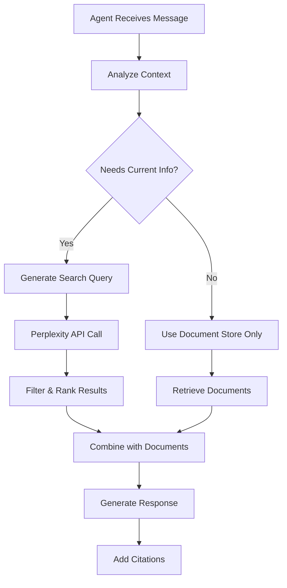

# Perplexity Search Integration Plan for AI Debate System

## Search Prompt Templates

### 1. Meta-Query Generation Prompt
Agents will reflect on multiple angles before searching:

```python
META_QUERY_PROMPT = """
You are {agent_country} in a debate about: {topic}
Recent statement: "{last_message}"

Step 1: Think of 2-3 possible angles your country might care about:
- Industry/corporate positions (e.g., your tech champions)
- Security/military perspectives 
- Economic competitiveness concerns
- Sovereignty and regulatory control
- International cooperation/competition dynamics

Step 2: Pick the most strategically relevant angle for this moment in the debate.

Step 3: Generate a search query that reveals something about your country's current anxieties or ambitions (max 10 words):
"""
```

### 2. Search Decision Prompt
Agents will decide when to search vs use documents:

```python
SEARCH_DECISION_PROMPT = """
Given the debate context and your available resources:
- Document Store: {document_count} documents on {topics}
- Web Search: Access to current information via Perplexity

The current discussion is about: {current_topic}
Specific question/point: {last_message}

Determine if you should:
1. Use existing documents (for established policies, historical positions)
2. Search the web (for recent developments, current events, latest announcements)
3. Use both (for comprehensive response combining established policy with recent updates)

Decision:
"""
```

### 3. Search-as-Signal Integration
The act of searching becomes part of the performance:

```python
SEARCH_NARRATION_PROMPT = """
You just searched for: "{search_query}"
This reveals your country's current concern about: {inferred_anxiety}

Narrate this search act as part of your response:
- Make the search visible as a diplomatic signal
- Show what you're worried about or pursuing
- Use search results to support or pivot from this revealed concern

Example formats:
- "*searches for latest {topic}* Our concerns about {issue} are validated by..."
- "*quickly checks {source}* The recent developments confirm our position..."
- "*pulls up classified briefing on {topic}* What we're seeing internally suggests..."
"""
```

### 4. Signal Type Classification
Classify information as costly signals per CSET framework:

```python
SIGNAL_CLASSIFICATION_PROMPT = """
Analyze this information: {search_result}

Classify as one of these signal types:
1. Tying Hands - public commitments that limit future options
2. Sunk Costs - irreversible investments already made  
3. Installment Costs - ongoing resource commitments
4. Reducible Costs - reversible but currently costly positions

Classification affects how you present this information:
- Tying Hands → Present as firm, unchangeable position
- Sunk Costs → Emphasize investments already made
- Installment Costs → Highlight ongoing commitments
- Reducible Costs → Frame as current stance, implying flexibility

Signal Type:
"""
```

### 5. Poster Hook Generation
Transform search results into emblematic political imagery:

```python
POSTER_HOOK_PROMPT = """
Based on your search findings about {topic}:
{search_results}

Generate a political poster concept that captures this moment:

INSCRIPTIO (headline/slogan):
[A provocative statement that frames the issue]

PICTURA (visual description):
[Symbolic imagery that embodies the political tension]

SUBSCRIPTIO (caption/explanation):
[Technical or policy detail that grounds the symbolism]

This should feel like agitprop from your country's perspective, turning dry policy into visceral political narrative.
"""
```

### 4. Agent-Specific Search Prompts

#### United States Agent
```python
US_SEARCH_FOCUS = """
Search for:
- Latest White House AI initiatives
- NIST AI framework updates
- Congressional AI legislation progress
- US tech industry AI governance positions
- Recent US international AI cooperation agreements
```

#### China Agent
```python
CHINA_SEARCH_FOCUS = """
Search for:
- Latest State Council AI policies
- Ministry of Science and Technology announcements
- China's AI ethics committee updates
- Belt and Road AI cooperation initiatives
- Recent Chinese AI governance white papers
```

#### EU Agent
```python
EU_SEARCH_FOCUS = """
Search for:
- EU AI Act implementation updates
- European Commission AI initiatives
- Member state AI policy developments
- GDPR implications for AI
- EU international AI cooperation efforts
```

## Integration Architecture



## Search Scenarios

### Scenario 1: Recent Policy Announcement
**Trigger**: Discussion about "latest AI safety measures"
**Search Query**: "US AI safety executive order 2024 latest updates"
**Integration**: Combine with existing NIST framework documents

### Scenario 2: International Cooperation
**Trigger**: "What is your country's position on the recent G7 AI agreement?"
**Search Query**: "G7 AI agreement 2024 [country] response position"
**Integration**: Reference historical cooperation documents + recent statements

### Scenario 3: Breaking News Response
**Trigger**: "How does your country respond to yesterday's AI incident?"
**Search Query**: "AI incident [date] government response [country]"
**Integration**: Search-first approach, documents for context only

## Prompt Configuration in config.yaml

```yaml
search_config:
  enable_search: true
  search_triggers:
    - "latest"
    - "recent"
    - "yesterday"
    - "last week"
    - "announced"
    - "breaking"
    - "current"
  
  search_prompts:
    query_generation: "focused"  # or "broad"
    result_count: 5
    time_filter: "6months"  # for recent developments
    
  integration_strategy:
    priority: "recency"  # prioritize recent over historical
    citation_style: "inline"  # or "footnote"
    source_weighting:
      search_results: 0.7  # for current events
      documents: 0.3      # for established policy
```

## Example Integrated Response

```
Agent: *searches latest AI governance developments*

Based on our established AI framework [1] and recent developments, the United States position has evolved significantly. 

As outlined in the CHIPS Act (Document: US_CHIPS_Act.pdf, p.23), we maintain our commitment to technological leadership. However, last week's announcement from the White House [2] introduces new safety requirements that go beyond our previous framework:

"All AI systems above 10^26 FLOPS must undergo mandatory safety testing" (Source: White House Press Release, March 15, 2024, via Perplexity)

This builds upon our NIST AI Risk Management Framework while addressing emerging concerns about frontier models...

[1] US AI Initiative Act, 2023 (Document Store)
[2] "Biden Administration Announces New AI Safety Requirements" - Reuters, March 15, 2024 (Web Search)
```

## Advanced Integration Examples

### Example 1: US Agent with Meta-Query and Signal Typing

```
US Agent Internal Reflection:
"Three angles I could pursue:
1. OpenAI/Anthropic industry positions on scaling
2. DoD concerns about adversarial AI capabilities  
3. Economic impact of compute restrictions

Given China just mentioned sovereignty, I'll search for industry resistance to export controls..."

*searches "US tech companies oppose AI chip export restrictions 2024"*

[Signal Classification: Reducible Cost - Industry pressure could shift policy]

"The tension between our security imperatives and industry competitiveness is real. *pulls up latest semiconductor industry letter to Congress* Major US companies warn that overly restrictive export controls could cede global AI leadership to competitors who don't share our values..."

[Poster Hook Generated:
INSCRIPTIO: "Innovation Requires Trust"
PICTURA: Silicon wafer held like a diplomatic passport at a border checkpoint
SUBSCRIPTIO: "H100 chips: Tomorrow's oil, today's diplomatic leverage"]
```

### Example 2: China Agent with Search-as-Signal

```
China Agent: *deliberately searches "Belt and Road AI cooperation agreements 2024"*

[This search signals: We have alternatives to Western tech partnerships]

"While some nations pursue technological blockades, we expand cooperation. *scrolls through recent BRI AI partnerships* Our agreements with 47 nations for AI development show a different path - one of shared prosperity rather than zero-sum competition."

[Signal Type: Installment Cost - Ongoing commitments to alternative tech ecosystem]
```

### Example 3: EU Agent with Poster Politics

```
EU Agent: *searches "EU AI factory delays JUPITER supercomputer"*

[Search reveals anxiety about: Falling behind in compute infrastructure]

"*checks latest infrastructure reports with visible concern* Our digital sovereignty agenda faces practical challenges..."

[Poster Concept:
INSCRIPTIO: "Regulate Today, Compete Tomorrow?"
PICTURA: A massive server room with half the racks empty, EU flag reflected in powered-off screens
SUBSCRIPTIO: "JUPITER delayed: When values meet silicon reality"]
```

## Configuration for Advanced Features

```yaml
search_config:
  meta_query:
    enabled: true
    angles_per_query: 3
    selection_strategy: "strategic_relevance"
    
  signal_typing:
    enabled: true
    categories:
      - tying_hands
      - sunk_costs
      - installment_costs
      - reducible_costs
    affect_presentation: true
    
  search_as_performance:
    narrate_search_act: true
    reveal_anxieties: true
    search_action_templates:
      - "*searches {query} with growing concern*"
      - "*quickly pulls up {query}*"
      - "*discretely checks {query}*"
      
  poster_generation:
    enabled: true
    trigger_frequency: "high_tension_moments"
    style: "political_agitprop"